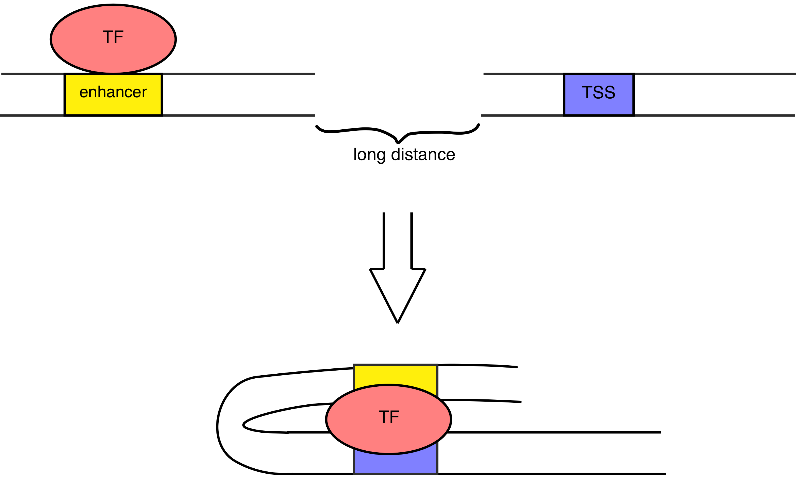
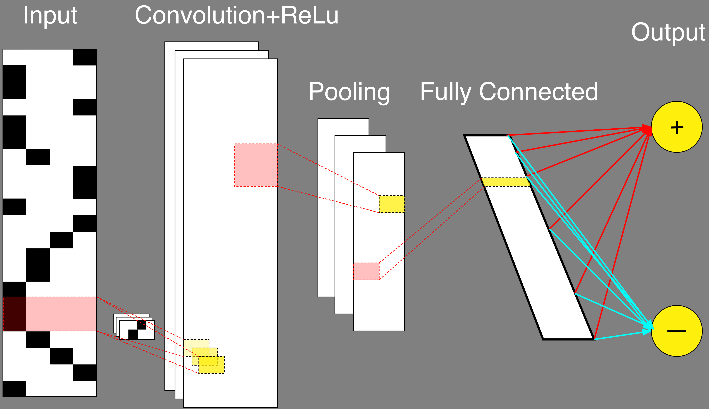
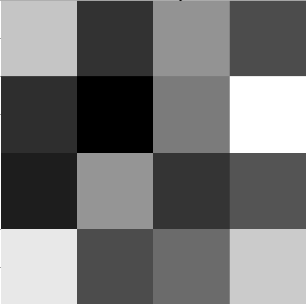
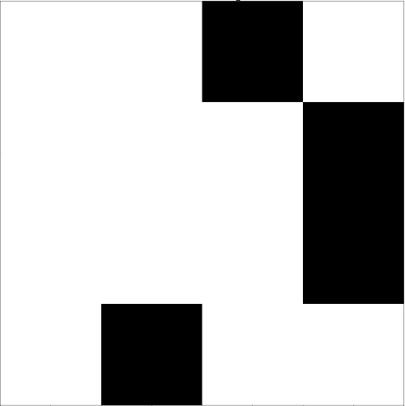

```{r setup, include=FALSE}
knitr::opts_chunk$set(echo = TRUE)
```

# Introduction
Enhancers is the region of DNA sequences that can be bound
by transcription factors (TF), specific proteins, and increase a likelihood of 
gene activation by brining the TF to a promoter region of a gene, which might 
locate thousands basepairs from an enchancer. The described behaviour of an 
enchancer is called a looping model, since the DNA string creates a loop and allows
enchancers to bind to promoter regions. 

Important note is that not every binding of TF to the DNA-sequence and dna-sequence
looping is an enchancer. Sometimes DNA-string just loops randomly creating an 
interaction between its parts. Figure 1 below illustrates this concept.

  

To understand the location of enchancer along the genome is a big step in 
understanding the gene regulation.

So far the traditional solution is that enhancers are identified by 
high-throughput biological experimental techniques. It is known that enchancers
are cell specific, which means that for different cells different enchancers
are identifed. Despite that a lot of enchancers have been identified already,
just limited amount of cells were covered. Since experiments are expensive to run,
it is desireable to have a computational approach to define enchancers for 
other cells. 

In this paper we describe an application of convolution neural network to
a genomic region to identify enchancers.

# Problem statement
To identify enchancers for human genome based on just
genomic-sequence of nucleotides with help of convolution neural network, 
we consider a supervised binary classification problem. 
An input is genomic region, and an output is one of 2 classes: 
enchancer (positive label) or not enchancer (negative label).

Since current approach is working with images, one
of first task to be performed is transformation of input data - genomic region, 
to an image. 

# Data description and preparation
The data used for an analysis is a part of FANTOM5 collection, and describe
65423 genomic regions identified as enhancers in human genome using hg19 assembly.
Data contains infromation about enchancers among 23 pairs of chromosomes, including chromosomes X and Y as 1 pair.

The original data is presented in a bed format, where we are interested in 
first three columns: chromosome id, starting position, ending position.

Important to notice that since our data describes genomic regions which are
stated as being enchancers (positive sample), there is a need in generating a 
negative sample to perform a classification analysis.

## Negative samples generation
For the analysis we consider two different approaches to generate negative samples:

1. Take a random compliments of positives samples using the whole genome for 
every sample and chromosome specific.
- advantages: genomic sequence exist  
- disadvantages: resulting sequnce might be an undiscovered enchancer, which
is not presented in the database

2. For every sample shuffle the nucleotide sequence corresponding to a genome 
region.
- advantages: if sequence doesn ot exist it is for sure not an enchancer
- disadvantages: sequence might do not exist

The nucleotide sequence was generated by usingfaidx command from samtools.

## Truncate for fixed size
Since CNN works with an input of same length it is necessary to truncate the derived sequence of nucleotides to a specific length to perform an analysis. In this 
analysis the selected length is 60. 

If provided enchancer region does not have 60 base pairs in a length, then
the region was disregarded. If length is bigger than 60, then first 60 elements
were selected for an analysis.

## Transformation from a sequence to an image.
As we stated before, CNN expects to see an image as input data. Thus, it is
neccesary to transform a nucleotide sequence in an image. In this work we
use 1-channel images - black and white. That is, values are 0 or 1.

To transform a data, which presents a collection of strings, where every string is
a combination of n letters(A, C, T, G), we use a as one-hot vector of size 1x4:  
A - 1000, C - 0100, T - 0010, G - 0001.

Consequently, n-length sequence is transformed to a matrix with dimension: $n \times 4$,
and provided to a cnn as an input. An example of input image is provided below.


# CNN structure
In this paper the analysis is based on convolution nural network with
1 convolution layer, 1 ReLu layer, 1 pooling layer using max function, and
1 fully connected layer, which is followed by output. To train the network
Tensorflow API was used in Python3.

The structure is visualised on picture below.



## Features design in convolution layer
We implemented and compared the performance of CNN with 2 different types of 
features. One set is features correspond to a concept of position weight matrix,
and are learned by Tensorflow. It looks like a continious set (Left picture below).
Second set of features corresponds to k-mers and
is created by simulating random nucleotide sequence in one-hot representation. 
This set looks like a discrete set with 1 value on a row. Such features are fixed
and not adapted by Tensorflow. (Right picture below).




In both cases the width of features is equal to 4, but the height is varies
and results of comparison is provided below.

The number of features equals to min($4^h$, 32), where h - feature height.
The minimum is due to a limit in computation power.

## Comparison of CNN with different hyper-parameters
We completed an analysis of 8 CNN with different hyper parameters, convolution 
features and negative samples. We compared both as accuracy as AUROC for all 
models. The comparison includes combination of:  

1. Negative sets: complement and shuffle  
2. Convolution features: position weight matrix and k-mers  
3. Height of convolution matrices from 1 to 20  
4. Max-pooling matrix size: 2x2, 60x1, (convolution feature height) x 2  

The comparison was performed on a validation set of size 0.2 of original size,
while training was completed on training set of size 0.7. Model was trained with
10 epochs.

The results of comparison of accuracy and AUROC is provided below:


We can see that for both performance measures there are 2 well-separated clusters,
which correspond to different negative samples. All models, which use negative
samples obtained from shuffling nucleotides in positive sequence perform better.

Also we notice that models, which use pwm features perform better than other,
which use k-mers. However, such results can be explained from biological perspective.
The reason is that enhancers are bind by several transcription factors. When
we model k-mers as features to catch, we are catching binding positions of
specific transcription factors. Since we allow to have maximum of 32 features,
it is not enough to detect enhancer. If we increase number of features, then model
with k-mers features might perform better. Also, k-mers features would be usefull
if we want to analyze enhancer for specific transcription factor.

Eventually, the selected model for future analysis is with shuffle as negative
samples, with 32 convolution freatures of size 4x4 and with max-pooling matrix of
size 2x2.

# Final training and testing model
To train and test final convolution neural network we use same training set
and a testing set as 0.1 of original data. The final cnn is trained with
following parameters:  
- 1 Layer CNN  
- Input image size = 60x4  
- Tensorflow adaptive features  
- Feature size = 4x4  
- 32 Filters in convolution layer  
- Pooling size = 2x2  
- Fully connected: 200  
- Number of epochs: 200  

The final accuracy on a test data set is 83% and AUROC is 85%. 

## Visualization of cnn
Tensorflow api provides an access to trained neural network by layers, which makes possible to perform visualization of interested parts. Below (next page) we provide a 
visualization of a full convolution network run after training for one image.


# Comparison with previous works
As we stated before the trained network provide a result of 85% in AUROC. Meanwhile,
the DeepEnhancer model get resulted AUROC of 91%, analysing same dataset.

The reason for better performance of DeepEnchancer is that model considered more
layers in CNN and negative samples were generated in a more complicated
way with an input of other biological information like chromatin state. Which
is different from my idea of doing an analysis completely using just genomic 
region as an input.

# Possible future research
One of an interesting questino to analyze is influence of diffent convolution 
convolution features on prediction. It is possible to use position weighted matrices
as features obtained from libraries like JASPAR, rather than allow tensorflow to 
lear them.

Also, it would be interested to analyze pwm features which tensorflow learned and
compare them with some well-known transcription factor motifs to learn more
about different tf, which are binding to specific motif.

# References
1. N. D. Heintzman and B. Ren, “Finding distal regulatory elements in the human genome,”
Current opinion in genetics & development, vol. 19, no. 6, pp. 541–549, 2009.

2. X. Min, N. Chen, T. Chen and R. Jiang, "DeepEnhancer:
Predicting Enhancers by Convolutional Neural Networks," 
IEEE International Conference on Bioinformatics and Biomedicine (BIBM), 2016

3. Tensorflow manual: https://www.tensorflow.org/programmers_guide/


